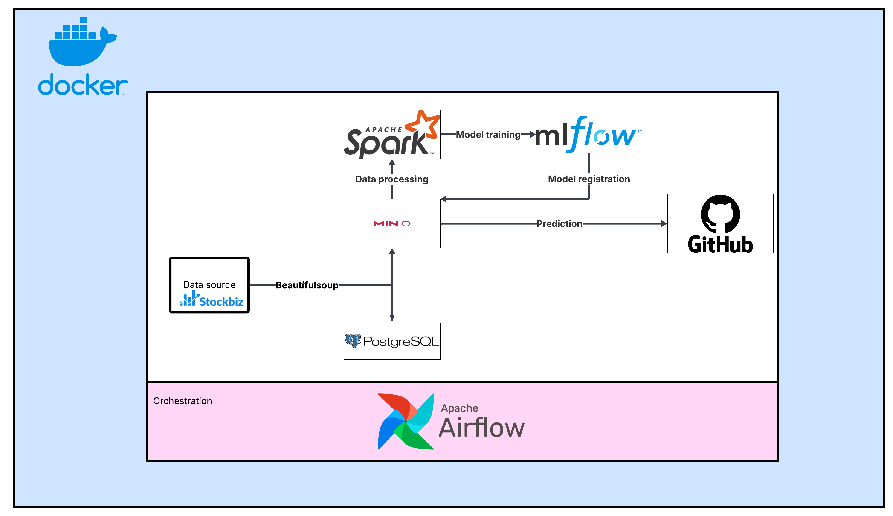

# Stock-prediction-system
Automated daily-run program for stock price prediction: Every day the program automatically scrapes new data, makes prediction and plots it on my website hosted by Github.

Tool used: Airflow, Minio, MLflow, Docker, Python, SQL, Pyspark

To run: 
1. Create secret and access key in Minio and update the value in config.env and Stockpipline.py
2. Run model.py in MLFlow file to create model in Minio
3. Create token in Github and set up Github page
4. Run Stock pipline dag

